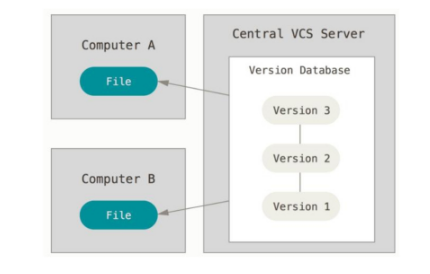
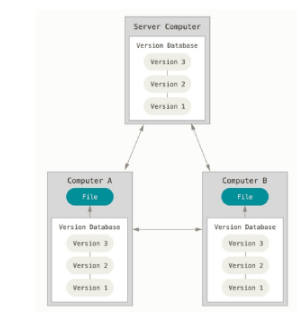
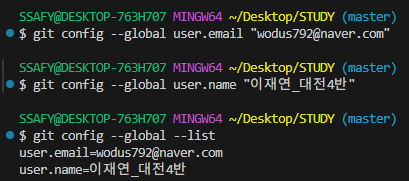

# GIT (분산 버전 관리 시스템)

## 버전 관리
- 변화를 기록하고 추적하는 것
- `코드 버전관리 필수` -> git 사용 이유

### 방법
- 파일명에 날짜와 시간 기록
- 변경사항 기록하는 파일 생성
- 마지막 파일과 이전 변경사항만 남기기 (용량 최적화)

### git 코드 버전 관리
- 추가된 기능 구현 및 코드 버전을 정리
- 모든 기능에 대한 코드 합쳐서 최종 구현
- 만약 한 기능에 오류 발생 시 해당 버전의 코드에서 수정 진행

## git
### 중앙 vs 분산
1. 중앙 집중식
- 버전은 중앙 서버에 저장되고 중앙 서버에서 파일을 가져와 다시 중앙에 업로드
- 문제 
  - 다른 사용자가 중복된 코드를 수정했을 경우 **충돌 발생**

2. 분산식
- 버전을 여러 개의 복제된 저장소에 저장 및 관리
- 변경 사항이 기록되어 있는 파일을 내려받기
  - 작업을 진행한 후 해당 부분에 대해 버전 기록 & 업로드
  - 업로드 변경 파일 작업 진행 
- 문제 
  - 다른 사용자가 중복된 코드를 수정했을 경우 

  -> 버전 기록 당시 두 코드에 충돌이 발생한다는 상황만 알게 되고 **원본에 대한 충돌은 발생하지 않음**

## git의 영역
1. Working Directory
  - 작업 중인 영역
2. Staging Area -> 임시 파일 저장 구간
  - Working Directory에서 변경된 파일 중, **다음 버전에 포함시킬 파일**들을 선택적으로 추가하거나 제외할 수 있는 **중간 준비 영역**
  - 선택하지 않은 임시 파일은 모두 삭제됨
3. Repository
  - 저장소
  - 버전 이력과 파일들이 영구적으로 저장되는 영역
  - `commit` : 버전 저장 행위

# 실습
## git
- `git init` : 해당 폴더를 깃으로 관리한다. 
- `git add` : `git add 00_startcamp/01_git/markdown.md `
  - git에 파일 추가하기 
  - 추가한 파일을 수정했을 경우 다시 `git add` 진행

- `git status` : git의 현재 상태 확인

- `git commit -m "<버전 이름>"` : 버전 만들기  
- `git config --global user.email "you@example.com"`
- `git config --global user.name "Your Name"`

- `code ~/.gitconfig` : gitconfig 파일에 들어가서 메일 또는 이름 수정 가능

- `git log` : commit한 정보 확인 가능

