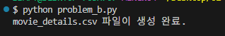

# 과제 완료
## problem_a
### 소스코드

### 실행 화면

## problem_b
### 소스코드

### 실행 화면

## problem_c
### 소스코드

### 실행 화면

## problem_d
### 소스코드

### 실행 화면

## problem_e
### 소스코드

### 실행 화면

## problem_f_1
### 소스코드

### 실행 화면

## problem_f_2
### 소스코드

### 실행 화면

# 느낀점
- 단계별로 구현 과정 중 학습한 내용, 어려웠던 부분, 새로 배운 
것들 및 느낀 점을 상세히 기록한 README.md 
## 박주양

## 이재연
### 배운 내용
- 항상 pandas만 사용했기에 python에서 파일 open, write하는 방법에 대해 배웠다. 
- API 키 발급 받는 방법과 데이터 조회하는 법에 대해 배움.
### 어려웠던 점
- API 키를 발급받아 데려오는 부분이 어려웠다. 

### 느낀 점
- git을 활용하여 branch를 만들고 코드를 수정한 후 마지막에 master에 merge하는 부분이 직접 체화된 것 같다.
- 원래는 branch를 문제를 풀 때마다 master에 merge하며 새롭게 branch를 생성해보려 했지만 시간이 부족하여 
그렇게 진행하지 못했다. 다음 번에는 꼭 시도해보고 싶다.
